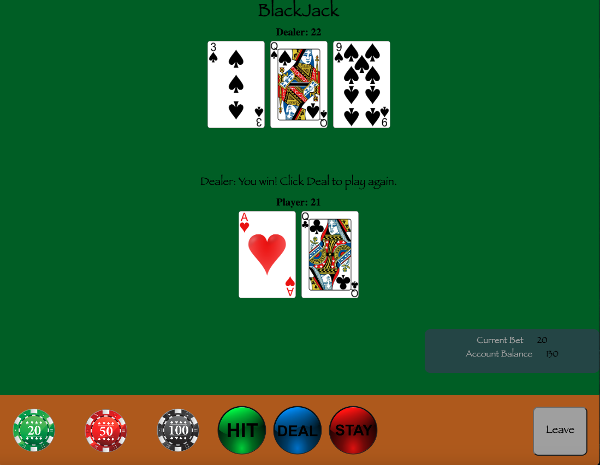
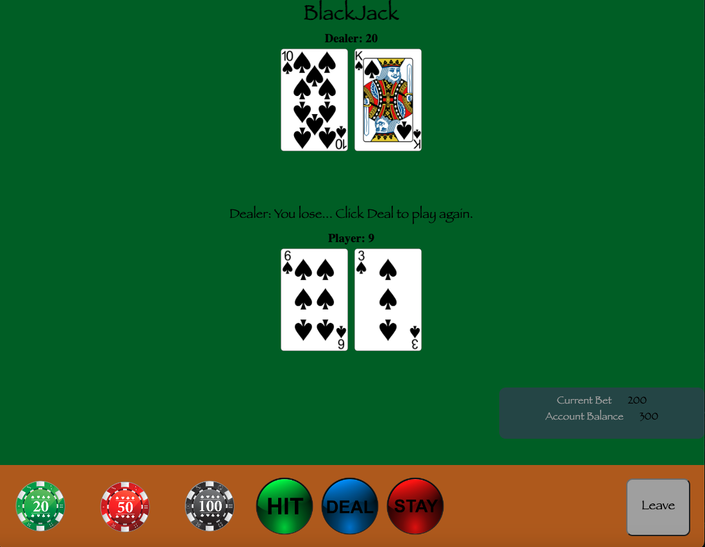
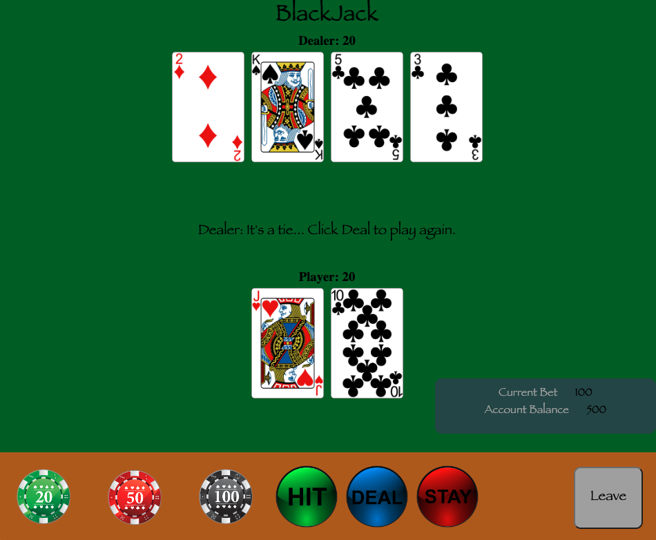

# Blackjack

The goal of Blackjack is to beat the dealer by having the higher total hand without going over 21.  Face-Cards (King, Queen, Jack) are worth 10 points, Aces are worth either 11 or 1 (depending on the total value of your hand), and all non-face cards are worth their corresponding number.  This game uses one, 52 card deck.

There is also a wager system which allows you to place a bet by selecting multiple $20, $50, or $100 chips as the Ante' (you start with $500 in your account, so bet wisely!)

The payout for a winning hand is 3 times your wager (if you bet $50, you will win $150)

# Screenshots
 - Landing Page
 

 - Winning!
 

 - Not Winning :-/
 

 - A Tie...
 

# Technologies
    * Javascript
    * HTML
    * CSS

# Game Play

    * Upon launching you will be presented with the Blackjack table overlay, which consists of the main table (empty) and a user panel.
    * You start the game with $500 in your account.  
    * To begin a round, first enter your wager by selecting one or several of the $20, $50, or $100 chips located in the interactive user panel located in the bottom of the screen.  Note, you cannot wager more than you have in your account.
    * Next, click on the "Deal" button to receive your cards, and to view the dealers "hidden" card and their revealed card.
    * Depending on your hand select either "Hit" to add another card to your hand, or "Stay" to end your turn and let the dealer take their turn.
    * After receiving/viewing the results you can chose to either play again by clicking "Deal" or leave the game by clicking the "Leave" button.
    * You can play until your bank account is less than 20!

# Future Enhancements

    * Timer delay for dealer hits
    * CSS visuals to make the UI look more authentic
    * Messaging system updates
    * Dealer and Player Score visualized on the page
    * Responsive 
    * Don't show cards immediately on subsequent deals

# Known Issues
    * On subsewuent hands the Deal button is not disabled after placing a bet
    * Ace Math Logic sometimes does not provide the expected outcome
    * Should not be allowed to hit once you go over 21