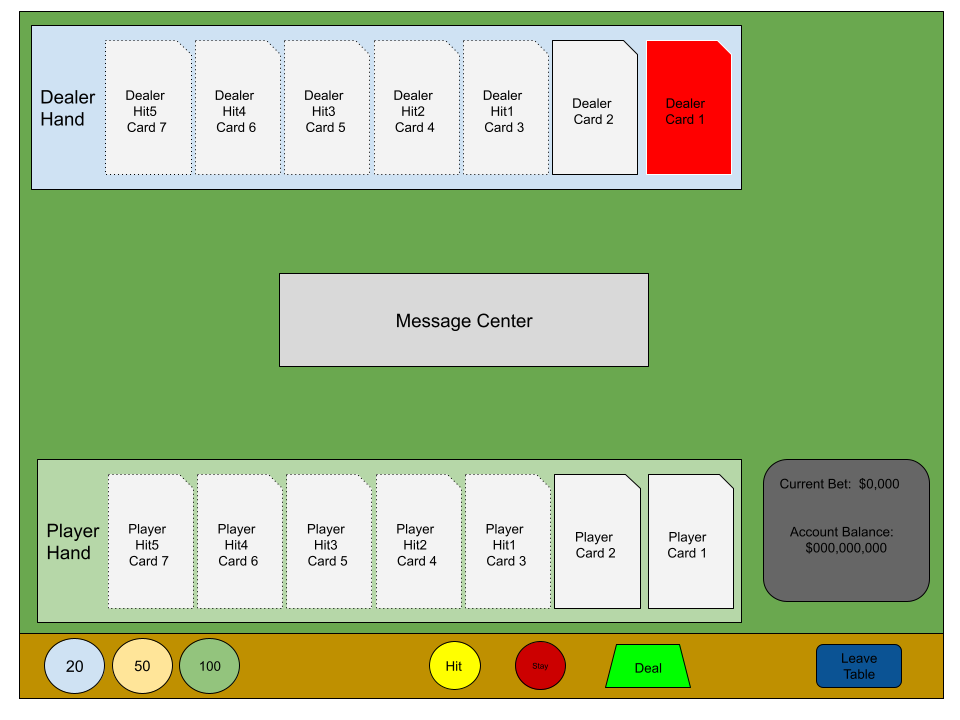

## This file will be used for notation and planning the games user, business and techincal requirements and approach for the BLACKJACK game.

## Wireframe:

## General rules/assumptions:
- Turn based logic --> player response until selecting stay, dealer response until selecting stay
- Player will win $100 if they win the round
- Player must click "Stay" to end their turn
- Only 1 deck is in play (52 cards), no Jokers
- There are only 4 cards selectable for each suite (i.e. 4x Aces, 4x 2's, 4x Queens, etc)
- A player cannot leave the game once the hand is dealt

## (Player)
    ### (Ante Amount)
        - The player must enter a bet (ante) of either $20 $50 or $100 to play the game by selecting the corresponding button.
        - The player can bet up to their maximum account balance
        - An error message ("Dealer: Thats more than you have!  Place a lower bet, or click Deal") will appear in the message center if the player presses an amount button which either when accumulated or is naturally greater than their bank account.  

    ### (Inital Deal of the Players Hand)
        - The player will click the deal button to initiate the dealing of their hand
        - The player will be presented with 2 random cards faced up, side by side in a row (card1 on left, card2 on right)
        - At the sametime the Dealer Hand will show with one card facing up and one card facing down at the top of the screen
        - A message ("Dealer: Your turn...") will appear in the message center

    ### (Hitting)
        - Only allowed if the players cards do not equal 21 
        - Player will press the 'Hit Me' button and another faced-up card will appear to the immediate left of left most player card.
        - There will be a maximum of 4 'Hit Me's, allowed. IRL there would be a max of 

    ### (Staying)
        - Player can press "Stay" button to receive no additional cards for the remainder of the round (game)
        - Turn goes back to computer

    ### (Account Balance)
        - Player will start with a $100 balance in their account
        - Balance Decreases:  The amount the player Antes will be deducted from the balance (ex: player before balance = $100, player Ante = $50, current balance = $50)
        - Balance Increases:  This will only happen if the player wins the round... Balance = current balance + ante amount + $50

    ### (Winning the round)
        - Player wins by getting 21 from value of all cards
        - Player wins by dealer busting (going over 21 value of cards)
        - Account Balance increased by 50
        - A message appears "Dealer:  Congratualtions, you won!  Click Deal for another hand..."
    
    ### (Ties)
        - Player will option to play again, money will be return to account, player can enter a new Ante
        - Player can leave and all ante money will be returned to account
        - A message appears "Dealer:  No winner here, click deal for another hand..."
    
    ### (Losing the round)
        - If the dealer has the higher value after the player has elected to stay, the dealer will not take another hit.  A message will appear "Dealer:  Looks like you lost that one!"  
        - If the player has an account balance >= 20 then the message will also read "Try again?"
        -Else the player will receive a message "You don't have enough funds for another game, better luck next time!"

    ### (Leaving the game)
        - Player can click "Leave" button on their turn, this will end the game and they will leave with what amount is in their account balance
        - Player automatically leaves the game if their account balance = 0
        - A message will appear "Dealer: Thanks for playing, be seeing you!"

## (Dealer (computer))
    ### (Initial Hand)
        - 2 random cards will be selected by the math random selection function
        - Dealer card 1 will be faced down, Dealer card 2 will be faced up

    ### (Hitting)
        - The dealer will not take a hit if the total of dealer card 1 and dealer card 2 is 20
        - Random integer logic will be used to determine if the dealer takes a hit for all subsequent hits where the value is lower than 20*
        - A message will appear "Dealer:  Dealer Takes a hit..."
        - There should be a delay between when the dealer takes an action to simulate the dealer thinking about their options

    ### (Staying)
        - The dealer will stay if the value of the 2 cards is =20 on the initial deal, and first hit.  Random integer logic will be used to determine if the dealer will take a hit on the 2nd and subsequent hits if the total of the hit is less than 18
        - A messge will appear "Dealer:  Dealer stays..."

    ### (Losing to Player)
        - Refer to the player win message 

    ### (Tieing the Player)
        - Refer to the player tie message

# Functional Approach

## Calculate Initial deal for Player
    execute random integer math values 1 - 11 for playerCard1
    execute random integer math values 1 - 11 for player card 2
    if player has 2 cards where the value of 22 (11 each) (**2 Aces scenario)
        player.card1Value = 1, player.card2Value = 11
    execute card1 match number to card visual (ex. card1 = 2, visual = 2-of-hearts.png)
        display card1 on the screen in the player-hand container, card-1 section
    execute card2 match number to card visual 
        display card2 on the screen in the player-hand container, card-2 section
 
playerTotal = card1Value + card2Value

## Calculate Initial deal for Dealer
- Exectue random integer math values 1 - 11 for dealerCard1
- Execute random integer math values 1 - 11 for dealerCard 2
- if dealer has 2 cards where the value of 22 (11 each) (**2 Aces scenario)
        dealer.card1Value = 1, dealer.card2Value = 11
    execute card1 match number to card visual (ex. card1 = 2, visual = 2-of-hearts.png)
     display card1 on the screen in the dealer-hand container, card-1 section
    execute card2 match number to card visual 
        display card2 on the screen in the dealer-hand container, card-2 section
    
## Calculate Winning Inital Hand
 - If inital-hand and player hand = 21 and dealer hand less than 21
    player wins

## Calculate Winning hand
 - If the dealer has 21 and the player has less than 21 the dealer will stay for all subsequent hit opportunities
 - The winner is determined by who has the larger total of the card values

##TO-DO
1. Get visuals
    a. Cards
    b. Table

2. Setup HTML per wireframe

3. Setup CSS per high Fidelity specifications
    a. dealer hand
    b. message center
    c. player hand
    d. Buttons
        i. Wager (20, 50, 100)
        ii. Action (Hit, Deal, Stay, Leave)
    e. Bet and Balance section

4. Code JS
    a. constants
    b. variables
    c. functions
        i. init
        ii. create the deck
        iii. shuffle the deck
        iv. render the deck
        v. calculate the hands
        vi.
    e. event listeners
        i. wager button click
        ii. hit button click
        iii. stay button click
        iv. deal button click
        v. leave button click

